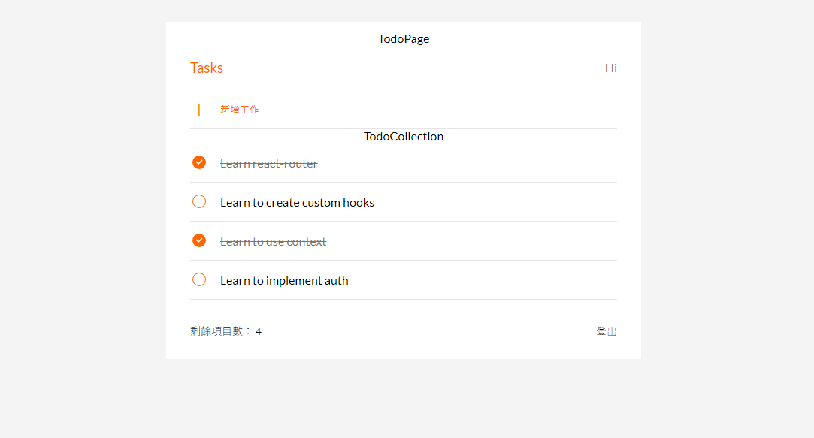

# Todo List for React

## Introduction
This is a Todo List made with React framework, it can browse, create, edit, delete.

## How to use
1. Clone this project in terminal:
```
git clone https://github.com/Yuanuanuan/short_url.git
```
2. After moving to this file in terminal type:
```
npm install
```
3. After installation, enter:
```
npm run start
```
4. Open the URL to get started:
```
http://localhost:3000
```
5. If you want to close, Just press 'Crtl + C' :
```
Crtl+C
```
---
Hope You Will Enjoy It !
